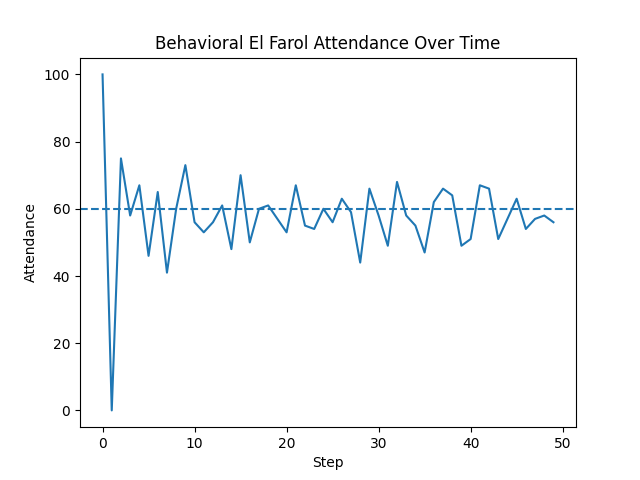

# Behavioral Boltzmann Wealth Model

## Overview

This model implements a behavioral extension of the classic Boltzmann wealth exchange model using a structured decision pipeline.

Agents repeatedly interact in pairs and exchange wealth. In the standard formulation, transfers occur randomly and lead to an emergent unequal wealth distribution.

In this version, agents do not automatically participate in exchanges. Instead, they decide whether to risk wealth through an explicit decision process.

---

## Model Description

Each agent follows a five-stage decision pipeline:

1. **Observe**
    - Access own wealth
    - Observe partner's wealth
    - Access internal risk tolerance

2. **Belief Update**
    - Pass observed state forward (no separate belief model in this version)

3. **Evaluation**
    - Assess vulnerability based on current wealth
    - Compare relative wealth with partner
    - Compute a transfer propensity score

4. **Decision**
    - Convert evaluation into a probabilistic decision

5. **Action**
    - Transfer one unit of wealth or abstain

This structure separates interaction dynamics from decision-making and makes agent behavior explicit.

---

## Key Features

### Conserved Wealth Dynamics

- All agents start with equal wealth
- Wealth is exchanged in discrete units
- Total wealth remains constant throughout the simulation

---

### Behavioral Decision Rule

Instead of always transferring wealth, agents decide probabilistically:

- poorer agents are more cautious
- richer agents are more willing to risk
- relative advantage increases willingness slightly

The decision probability is computed using a logistic function:

$$
p(transfer) = 1 / (1 + exp(-score))
$$

where the score depends on both absolute and relative wealth.

---

### Heterogeneous Risk Profiles

Each agent is assigned a risk tolerance parameter:

- introduces variation in behavior
- prevents uniform decision patterns
- creates diversity in exchange participation

---

## Results

  

The model produces:

- Emergent wealth inequality from equal initial conditions
- A skewed distribution with many low-wealth agents
- Moderate concentration of wealth among a few agents

Compared to the baseline model, the distribution is shaped not only by random exchange but also by behavioral filtering.

---

## Implementation Notes

- Built using Mesa
- Modular structure:
    - `agents.py` — agent definition and state
    - `pipeline.py` — decision process
    - `strategies.py` — placeholder for behavioral extensions
    - `model.py` — interaction and scheduling

---

## Testing

The model includes tests to verify:

- Correct initialization
- Wealth conservation over time
- Non-negative wealth values
- Multi-step consistency
- Presence of agent-level behavioral parameters

---

## Discussion

In the standard Boltzmann model, inequality emerges purely from stochastic exchange.

In this version, agents do not passively participate. Instead, they evaluate whether to risk wealth based on their current state.

This introduces a second mechanism driving system outcomes:
- interaction dynamics (who meets whom)
- decision dynamics (who chooses to participate)

The model shows that even minimal behavioral structure can influence emergent distributions while preserving core system properties.

---

## Possible Extensions

- Dynamic adaptation of risk tolerance
- Savings behavior (partial transfers)
- Network-based interactions instead of random pairing
- Learning mechanisms based on past outcomes
